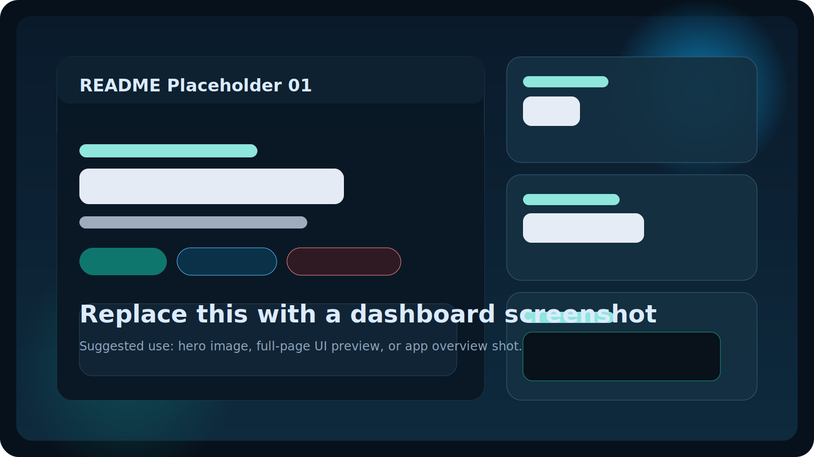
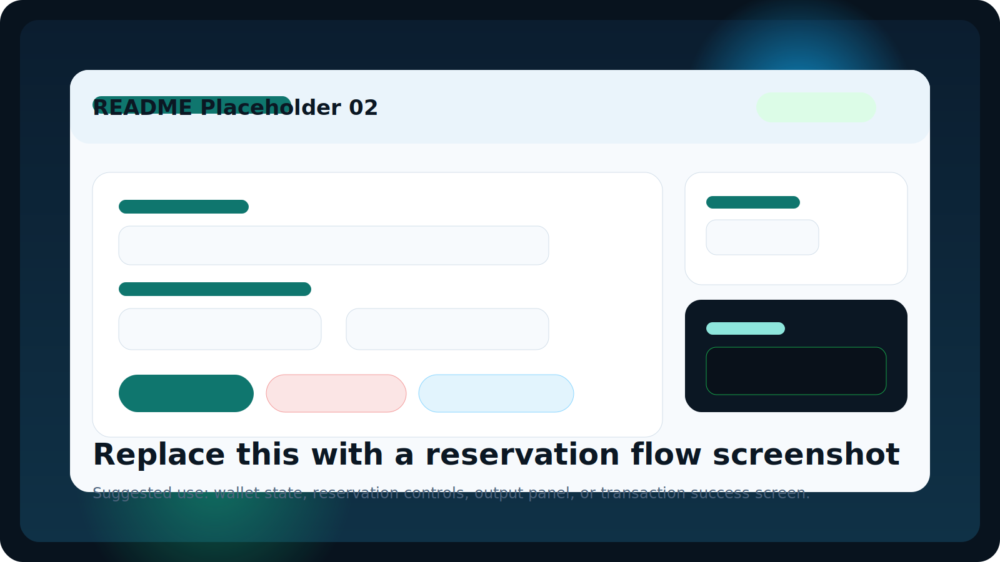

<p align="center">
  
  
</p>

<h1 align="center">Stellar Resource Availability Dashboard</h1>

<p align="center">
  A polished React frontend for a Soroban smart contract that lets teams register resources,
  reserve time windows, release reservations, and inspect on-chain state from one dashboard.
</p>

<p align="center">
  
  
  
  
</p>

## Contract Explorer

- Stellar Expert: https://stellar.expert/explorer/testnet/contract/CB3YQNIRZMEPO2WMXZL4M6SSBRZ3NNKSO4EXOKTPDCBRRQ674WG73PZX
- Contract ID: `CB3YQNIRZMEPO2WMXZL4M6SSBRZ3NNKSO4EXOKTPDCBRRQ674WG73PZX`

## Overview

This project combines:

- A Soroban smart contract for resource registration and reservation management
- A React + Vite dashboard for interacting with the contract
- Freighter wallet integration for authenticated write actions
- Read-only contract calls for resource lookup, listing, availability checks, and total count

The current frontend is designed as a clean operator console with live status output, wallet visibility, reservation timing summaries, and responsive cards for desktop and mobile.

## What You Can Do

- Register a new resource with owner, name, type, capacity, and location
- Reserve a resource for a specific start and end timestamp
- Release an active reservation
- Check whether a resource is available
- Fetch a single resource by ID
- List all registered resource IDs
- Retrieve the total number of registered resources

## Smart Contract Behavior

The Soroban contract stores each resource with:

- `owner`
- `name`
- `resource_type`
- `capacity`
- `location`
- `reserved_by`
- `has_reservation`
- `reserved_start`
- `reserved_end`
- `is_available`

Exposed contract methods:

- `register_resource`
- `reserve_resource`
- `release_resource`
- `check_availability`
- `get_resource`
- `list_resources`
- `get_count`

## Frontend Highlights

- Freighter wallet connect flow for authenticated transactions
- Live contract response panel for transaction and read-call results
- Reservation window formatting for human-readable time summaries
- Auto-sync of registered resource count on load and after registration
- Responsive dashboard layout with separate setup, reservation, wallet, and output panels

## Tech Stack

- React 19
- Vite 8
- `@stellar/stellar-sdk`
- `@stellar/freighter-api`
- Soroban smart contract in Rust

## Project Structure

```text
.
|-- contract/
|   `-- contracts/hello-world/src/lib.rs
|-- docs/
|   `-- readme/
|       |-- placeholder-dashboard.svg
|       `-- placeholder-reservation.svg
|-- lib/
|   `-- stellar.js
|-- src/
|   |-- App.jsx
|   |-- App.css
|   |-- index.css
|   `-- main.jsx
`-- README.md
```

## Local Setup

### Prerequisites

- Node.js installed
- npm installed
- Freighter wallet extension
- Access to Stellar Soroban testnet

### Install

```bash
npm install
```

### Run The App

```bash
npm run dev
```

### Production Build

```bash
npm run build
```

### Lint

```bash
npm run lint
```

## How The App Talks To Stellar

Write actions are signed with Freighter:

- `register_resource`
- `reserve_resource`
- `release_resource`

Read actions are simulated against the configured Soroban RPC endpoint:

- `check_availability`
- `get_resource`
- `list_resources`
- `get_count`

Configuration currently lives in [`lib/stellar.js`](./lib/stellar.js), including:

- `CONTRACT_ID`
- `DEMO_ADDR`
- Soroban testnet RPC URL
- network passphrase

## User Flow

1. Connect Freighter.
2. Fill in resource details.
3. Register the resource on-chain.
4. Reserve it with a time window.
5. Check availability or fetch resource data.
6. Release the reservation when needed.

## Placeholder Images

The two preview images at the top are placeholder SVGs stored here:

- `docs/readme/placeholder-dashboard.svg`
- `docs/readme/placeholder-reservation.svg`

You can replace those files later with real screenshots while keeping the same paths, and the README will update automatically.

## Notes

- The project is currently wired to Stellar testnet.
- Write actions require Freighter authorization.
- Read actions do not require an active wallet signature.
- If the count card or other read calls fail, check the contract configuration in `lib/stellar.js`.
